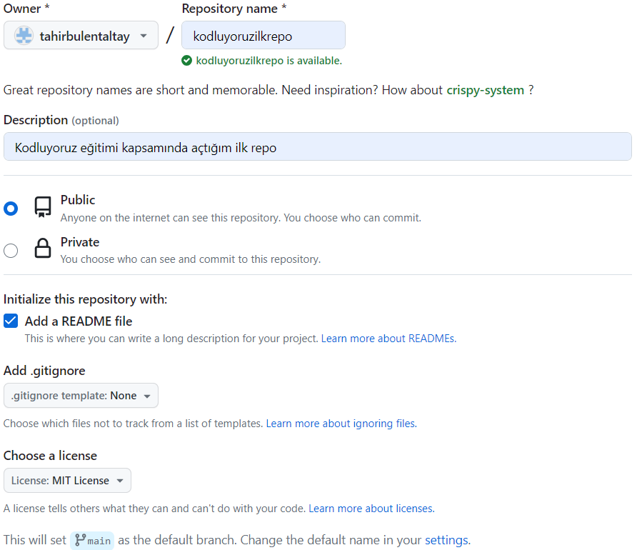

# Kodluyoruz İlk Repo

Bu repo [Kodluyoruz](https://kodluyoruz.org) Front-End Eğitiminde oluşturduğumuz ilk repo. İçerisinde bir adet README dosyası, bir adet de index.html barındırıyor.



## Installation

Öncelikle projeyi klonlayın (Buraya sizin reponuzdan aldığınız link gelecek.)

```bash
git clone https://github.com/tahirbulentaltay/kodluyoruzilkrepo.git

```

## Usage

Projeyi klonladıktan sonra Visual Studio Code programında açınız.

Linux için:

```Linux
cd kodluyoruzilkrepo
code .
```

## Contributing

Pull requestler kabul edilir. Büyük değişiklikler için, lütfen önce neyi değiştirmek istediğinizi tartışmak için bir konu açınız.

## License

[MIT](https://choosealicense.com/licenses/mit/)